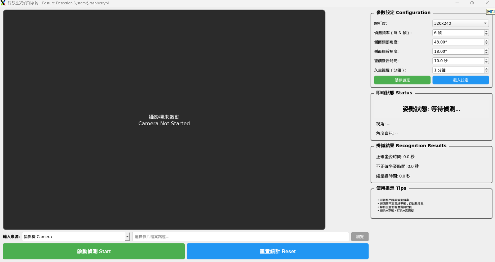

# 智慧坐姿偵測系統  
**Intelligent Posture Monitoring System**

---

## 專案簡介

智慧坐姿偵測系統是一套 **即時、非穿戴式** 的坐姿監測應用。  
系統透過 **攝影機影像** 搭配 **電腦視覺與姿態估計技術**，即時分析使用者坐姿，  
並在坐姿不良或久坐時間過長時，主動提供提醒。

本系統所有運算皆於 **本機端執行**，不會上傳影像或個人資料，符合隱私保護需求。

---

## 設計目的

現代人長時間使用電腦，容易出現駝背、頸部前傾與久坐不動等問題，  
但坐姿變差通常是漸進發生，使用者不易即時察覺。

本專案的目標為：

- 在坐姿不良 **持續一段時間後** 才進行提醒，降低誤判  
- 協助使用者即時調整坐姿  
- 提供久坐時間統計與提醒機制  

---

## 系統運作方式

系統整體流程如下：

1. 以攝影機或影片作為影像輸入  
2. 即時偵測人體關鍵點  
3. 自動判斷是否為側面視角  
4. 僅於側面視角下進行坐姿分析  
5. 依角度與時間條件判定是否提醒  

---

## 介面介紹（含圖說）

下圖為智慧坐姿偵測系統的主要操作介面，  
介面設計以 **即時監控、清楚回饋、操作直覺** 為核心。



---

### ① 影像顯示區（左側）

- 顯示攝影機即時畫面或影片內容  
- 系統尚未啟動時顯示 *Camera Not Started*  
- 為姿態偵測與角度計算的主要依據  

---

### ② 輸入來源設定（下方）

- 可選擇 **攝影機（Camera）** 或 **影片檔案（Video File）** 作為輸入來源  
- 影片模式可透過「Browse」按鈕選擇檔案  

---

### ③ 參數設定區（右上）

用於調整坐姿偵測相關參數：

- 影像解析度  
- 偵測頻率（每 N 幀偵測一次）  
- 頸部前傾角度門檻  
- 軀幹傾斜角度門檻  
- 坐姿不良提醒時間（秒）  
- 久坐提醒時間（分鐘）  

支援設定的 **儲存與載入**。

---

### ④ 即時狀態顯示（右中）

即時顯示系統判斷結果：

- 姿勢狀態（等待偵測／坐姿正確／坐姿不良）  
- 視角判定（側面或正面）  
- 頸部與軀幹即時角度數值  

---

### ⑤ 辨識結果統計（右下）

顯示坐姿時間統計結果：

- 正確坐姿時間  
- 不正確坐姿時間  
- 總坐姿時間  

可透過按鈕進行統計重置。

---

### ⑥ 操作控制按鈕（下方）

- **Start**：啟動坐姿偵測  
- **Reset**：清除時間統計資料  

---

## 系統狀態顯示說明

- 🟢 坐姿正確  
- 🔴 坐姿不良  
- ⚪ 正面視角（僅判斷視角，不進行坐姿分析）  

---

## 坐姿判定原則

系統主要依據以下兩項指標：

- **頸部前傾角度**
- **軀幹傾斜角度**

當其中任一角度超過設定門檻，且持續超過設定秒數，  
即判定為坐姿不良並觸發提醒。

---

## 久坐提醒機制

當系統持續偵測到使用者坐在畫面中時，會累積坐姿時間。  
若累積時間達到設定的分鐘數，系統將提醒使用者起身活動。  
若一段時間未偵測到人體，久坐計時將自動重置。

---

## 硬體需求

- **攝影機**：筆電內建或 USB 攝影機（建議 720p 以上）  
- **運算設備**：  
  - Windows / macOS / Linux 電腦  
  - Raspberry Pi 4 / 5（建議 4GB RAM 以上）  

---

## 軟體環境

- **Python**：3.8 以上  
- **作業系統**：Windows / macOS / Linux  

---

## 相依套件

- PyQt5 >= 5.15.0  
- opencv-python >= 4.5.0  
- mediapipe >= 0.10.0  
- pygame >= 2.0.0  
- pyttsx3 >= 2.90  
- numpy >= 1.19.0  


---

## 使用方式
```bash
python main.py


啟動後可選擇攝影機或影片作為輸入來源，
調整參數後即可開始坐姿偵測。

